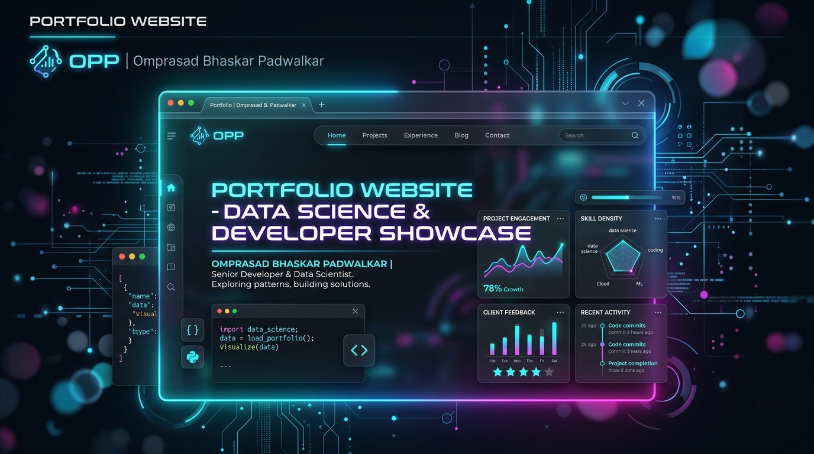

# 🌟 Omprasad Bhaskar Padwalkar | Personal Portfolio Website

[](https://github.com/omprasad-007/omprasad-portfolio)
[](#-tech-stack--tools)
[](#-about-me)

Welcome to my personal portfolio website repository! This platform showcases my projects, technical skills, verified certifications, and journey as a **2nd-Year Data Science Engineering** student and developer.

---

## 📌 Repository Metadata & About Section

To configure the **About** section on the GitHub repository sidebar:

- **Description**:  
  `Personal portfolio website of Omprasad Bhaskar Padwalkar showcasing SecurePay AI, KrishiSetu, AgroScan AI, 80th Independence Day Wishes, verified certifications, and Data Science projects. Built with HTML, CSS, JavaScript, SwiperJS & ScrollReveal.`
- **Website URL**:  
  `https://omprasad-portfolio.vercel.app/`

---

## 👋 About Me

Hi, I'm **Omprasad Bhaskar Padwalkar**  

🎓 **2nd-Year Data Science Engineering Student** at D Y Patil College of Engineering, Kolhapur  
💻 **Data Science & AI Developer** focusing on Machine Learning pipelines, Computer Vision, and Web Development  
🚀 Driven by a relentless growth mindset to build impactful, data-driven real-world applications  

---

## 🚀 Featured Projects

| Project Logo | Project Name | Description | Tech Stack | Live Demo / Status |
| :---: | :--- | :--- | :--- | :---: |
|  | **SecurePay AI** | An AI-powered secure payment & fraud prevention platform designed for safer digital transactions. | `AI` `Security` `FinTech` `UX` | [🔗 Live Demo](https://secure-pay-ai-lilac.vercel.app/) |
|  | **KrishiSetu - Bridge for Farmers** | Digital bridge empowering farmers with smart agritech tools, data analytics, and direct market connection. | `Agritech` `Data Science` `Web App` | [🔗 Live Demo](https://krishi-setu-bridge-for-farmers.vercel.app/) |
|  | **Portfolio Website** | Live personal portfolio presenting featured projects, skills, certifications viewer, and 2nd-year growth. | `HTML` `CSS` `JavaScript` `Vercel` | [🔗 Live Demo](https://omprasad-portfolio.vercel.app/) |
|  | **AgroScan AI** | An AI plant disease detector that uses Computer Vision to identify crop health issues early. | `AI` `Computer Vision` `Agri` | ⏳ Ongoing Project |
|  | **80th Independence Day Wishes** | Personalized patriotic wish generator celebrating 80th Independence Day with animated visuals & audio. | `Web App` `Interactive` `Animation` | [🔗 Live Demo](https://80th-independence-day-tau.vercel.app/) |

---

## 📜 Verified Certifications

- ☁️ **Use Google Cloud to Build Your Apps** - *Issued by Google Skills Boost*
- 💻 **C++ Programming & Algorithms** - *Object-Oriented Programming & Data Structures*
- 📊 **Data Science Foundations & Analytics** - *Exploratory Data Analysis & Statistical Modeling*
- 🐍 **Python for Data Science & ML** - *Data Manipulation, NumPy, Pandas, & ML Models*
- 🏆 **Hack2Skills Innovation & Hackathon** - *Rapid Solution Prototyping & Hackathon Project*
- 🗣️ **Professional Soft Skills & Communication** - *Level 1 Interpersonal Skills*
- 👔 **Advanced Leadership & Soft Skills** - *Level 2 Leadership & Workplace Readiness*
- ⚙️ **Engineering Skill Development** - *Technical Competencies & Practical Problem Solving*

---

## 🛠 Tech Stack & Tools

- **Core Languages**: Python, C, C++
- **Frontend & Web**: HTML5, CSS3 (Glassmorphism, CSS Variables, Gradients), JavaScript (ES6+)
- **Libraries & Tools**: Swiper.js, Feather Icons, Typed.js, ScrollReveal.js
- **Domains & Expertise**: Data Science Foundations, AI & Machine Learning, Computer Vision, Full-Stack Web Development

---

## ✨ Key Portfolio Features

- 🎨 **Modern Glassmorphism Design**: Custom dark/light theme toggle, glowing avatar, dynamic background blobs.
- 📱 **Fully Responsive Layout**: Seamless experience across mobile, tablet, and desktop displays.
- 🎠 **Interactive Swiper Slider**: Touch-enabled project carousel with active links and custom card designs.
- 📜 **Interactive Certificate Viewer**: Embedded modal preview for Google Drive certificate documents.
- ⚡ **Micro-Animations**: Smooth scroll reveal effects and typing text animation header.
- ✉️ **Integrated Contact System**: Direct mailto integration and complete contact touchpoints.

---

## 📂 Folder Structure

```
omprasad-portfolio/
├── assets/
│   └── images/
│       ├── omprasad-profile.jpg        # Profile Photo & Avatar
│       ├── securepay-ai-logo.jpg       # SecurePay AI Project Logo
│       ├── krishisetu-logo.jpg         # KrishiSetu Bridge Project Logo
│       ├── portfolio-website-logo.jpg  # Portfolio Website Project Logo Banner
│       ├── agroscan-ai-logo.jpg        # AgroScan AI Project Logo
│       ├── independenceday-logo.jpg    # 80th Independence Day Project Logo
│       └── project-ecommerce.png       # E-Commerce Project Preview
├── index.html                          # Main HTML Structure & Modals
├── style.css                           # Glassmorphism & Responsive CSS
├── script.js                           # Interactivity, Swiper & Certificate Modal Handler
└── README.md                           # Comprehensive Documentation
```

---

## ⚡ Getting Started Locally

1. **Clone the repository**:
   ```bash
   git clone https://github.com/omprasad-007/omprasad-portfolio.git
   cd omprasad-portfolio
   ```

2. **Open in Browser**:
   Double click `index.html` or run with Live Server in VS Code.

---

## 📫 Connect With Me

- 📧 **Email**: [omprasadpadwalkar007@gmail.com](mailto:omprasadpadwalkar007@gmail.com)
- 📞 **Phone**: [+91 9405856488](tel:+919405856488)
- 💼 **LinkedIn**: [Omprasad Bhaskar Padwalkar](https://www.linkedin.com/in/omprasad-bhaskar-padwalkar-824224394)
- 📸 **Instagram**: [@omprasad0075](https://www.instagram.com/omprasad0075)
- 💻 **GitHub**: [omprasad-007](https://github.com/omprasad-007)

---

### © 2026 Omprasad Bhaskar Padwalkar | Built with Vision & Passion 🚀
