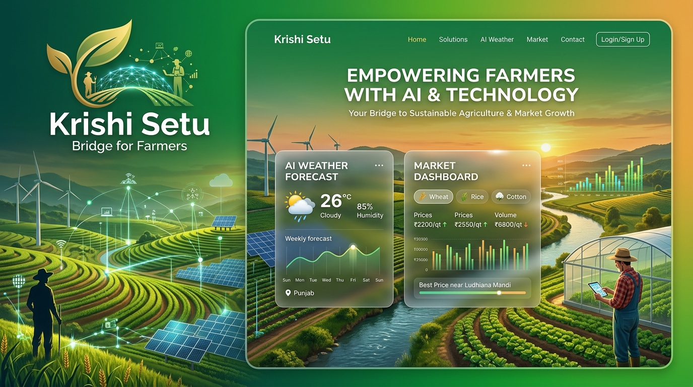
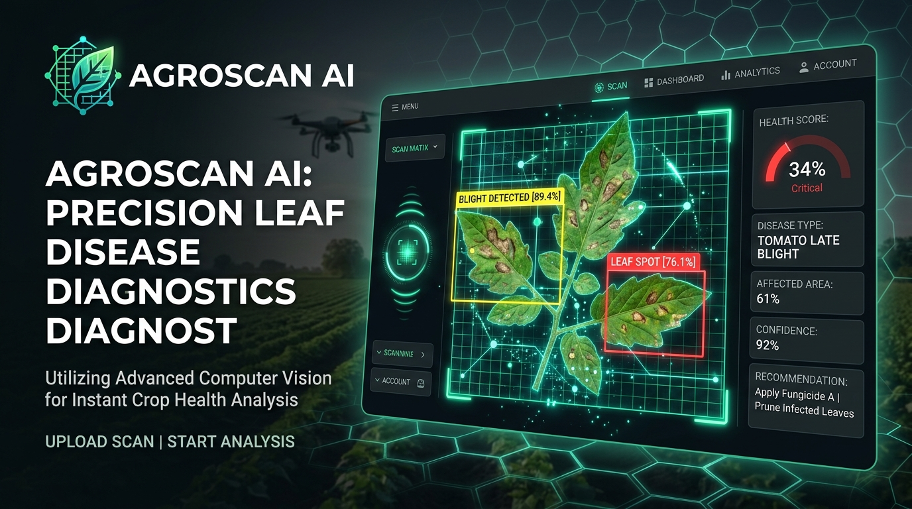

# 🌟 Omprasad Padwalkar | Personal Portfolio Website

[](https://github.com/omprasad-007/omprasad-portfolio)
[](#-tech-stack)
[](#-about-me)

Welcome to my personal portfolio website repository! This platform showcases my projects, technical skills, and journey as a Data Science Engineering student and developer.

---

## 📌 Repository Metadata & About Section

To configure the **About** section on the GitHub repository sidebar:

- **Description**:  
  `Personal portfolio website of Omprasad Padwalkar showcasing SecurePay AI, Portfolio Website, AgroScan AI, and Data Science projects. Built with HTML, CSS, JavaScript & SwiperJS.`
- **Website URL**:  
  `https://omprasad-007.github.io/omprasad-portfolio/`

---

## 👋 About Me

Hi, I'm **Omprasad Padwalkar**  

🎓 **First-Year Data Science Engineering Student** at D Y Patil College of Engineering, Kolhapur  
💻 **Passionate Developer & Innovator** with a focus on Web Development, AI, and Data Science  
🚀 Driven by a relentless growth mindset to build impactful real-world software applications  

---

## 🚀 Featured Projects

| Project Logo | Project Name | Description | Tech Stack | Live Demo |
| :---: | :--- | :--- | :--- | :---: |
|  | **SecurePay AI** | An AI-powered secure payment & fraud prevention platform designed for safer digital transactions. | `AI` `Security` `FinTech` `UX` | [🔗 Live Demo](https://secure-pay-ai-lilac.vercel.app/) |
|  | **Portfolio Website** | My live personal portfolio presenting featured projects, skills, and learning journey as a developer. | `HTML` `CSS` `JavaScript` `UI` | [🔗 Live Demo](https://omprasad-007.github.io/omprasad-portfolio/) |
|  | **80th Independence Day Wishes** | A personalized patriotic wish generator and greeting platform for 15 August 2026 with animated visuals & audio. | `Web App` `Interactive` `Animation` | [🔗 Live Demo](https://80th-independence-day-tau.vercel.app/) |
|  | **AgroScan AI** | An AI plant disease diagnostic platform utilizing computer vision to detect crop health issues early. | `AI` `Computer Vision` `Agri` | 🔬 In Development |

---

## 🛠 Tech Stack & Tools

- **Frontend**: HTML5, CSS3 (Glassmorphism & Gradients), JavaScript (ES6+)
- **Libraries & Icons**: Feather Icons, Swiper.js, Typed.js, ScrollReveal.js
- **Core Languages**: Python, C Programming
- **Domains**: Data Science Foundations, AI & Machine Learning, Web App Development

---

## ✨ Key Portfolio Features

- 🎨 **Modern Aesthetic**: Glassmorphism design, vibrant dynamic gradients & dark/light theme toggle.
- 📱 **Fully Responsive**: Optimized seamlessly across mobile, tablet, and desktop screens.
- 🎠 **Interactive Project Carousel**: Touch-enabled Swiper.js slider with custom project cards.
- ⚡ **Dynamic Micro-Animations**: Smooth scroll reveal effects and typing text animations.
- 📬 **Interactive Contact Section**: Direct access to social links and email.

---

## 📂 Folder Structure

```
omprasad-portfolio/
├── assets/
│   └── images/
│       ├── securepay-ai-logo.jpg       # SecurePay AI Project Logo & Banner
│       ├── krishisetu-logo.jpg         # Krishi Setu Bridge Project Logo & Banner
│       ├── independenceday-logo.jpg    # 80th Independence Day Project Logo & Banner
│       └── agroscan-ai-logo.jpg        # AgroScan AI Project Logo & Banner
├── index.html                          # Main HTML Structure
├── style.css                           # Modern CSS Styling & Responsive Rules
├── script.js                           # Dynamic Interactivity, Theme Toggle & Swiper
└── README.md                           # Project Documentation
```

---

## ⚡ Getting Started Locally

1. **Clone the repository**:
   ```bash
   git clone https://github.com/omprasad-007/omprasad-portfolio.git
   cd omprasad-portfolio
   ```

2. **Open in Browser**:
   Double click `index.html` or open it with Live Server in VS Code.

---

## 📫 Connect With Me

- 📧 **Email**: [omprasadpadwalkar007@gmail.com](mailto:omprasadpadwalkar007@gmail.com)
- 💼 **LinkedIn**: [Omprasad Bhaskar Padwalkar](https://www.linkedin.com/in/omprasad-bhaskar-padwalkar-824224394)
- 📸 **Instagram**: [@omprasad0075](https://www.instagram.com/omprasad0075)
- 💻 **GitHub**: [omprasad-007](https://github.com/omprasad-007)

---

### © 2026 Omprasad Padwalkar | Built with Vision & Passion 🚀
